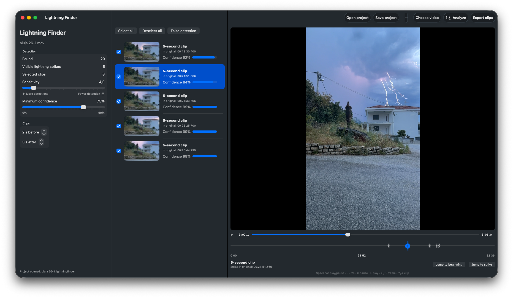
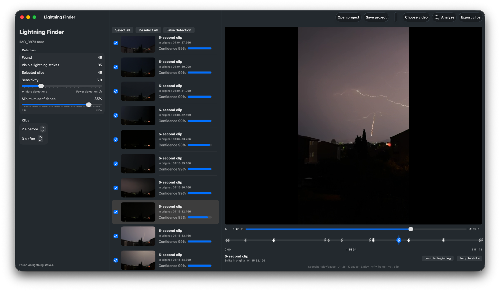
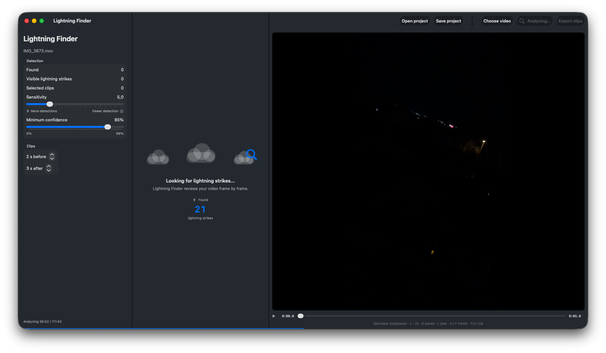
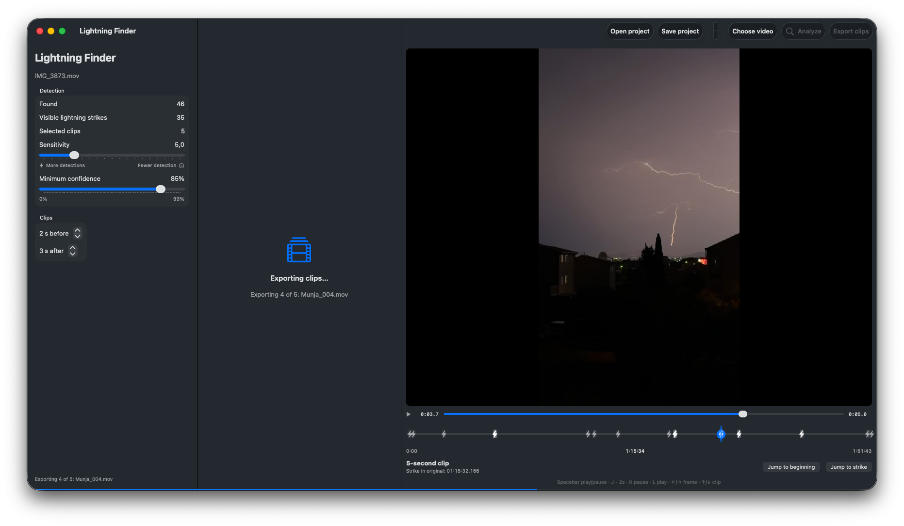
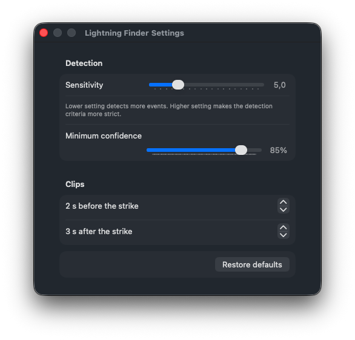
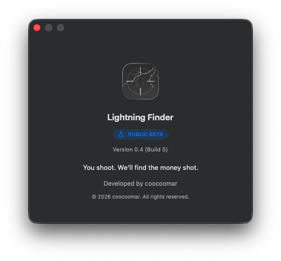

<div align="center">



# Lightning Finder

### Review hours of storm footage in minutes.

Lightning Finder automatically detects lightning strikes in video recordings, helping you review hours of storm footage in just minutes.

**Spend your time chasing the storm, not reviewing the shots.**

<br>

<a href="https://testflight.apple.com/join/XaqMH35h">
    
</a>

<br><br>

**Native macOS** • **Private by Design** • **No Cloud Processing**

</div>

---

> **Public Beta is now open.**
>
> Join the TestFlight beta, try Lightning Finder with your own recordings and help shape future releases through your feedback.

<br>

| ⚡ Native macOS | 🔒 Local Processing | 🎬 Export Selected Clips |
|:---------------:|:------------------:|:-----------------------:|
| Built exclusively for macOS | Videos never leave your Mac | Export only the moments that matter |

---

# Why Lightning Finder?

Finding lightning in long video recordings is slow.

Reviewing several hours of footage often takes longer than the recording itself.

Lightning Finder eliminates the repetitive work by automatically reviewing your recording, locating potential lightning strikes and letting you jump directly to every detected event.

Everything happens locally on your Mac.

---

# Features

| | |
|:--|:--|
| ⚡ **Automatic Lightning Detection** | Analyze entire recordings and automatically detect lightning strikes. |
| 🎬 **Export Selected Clips** | Export only the moments you want instead of the complete recording. |
| 📍 **Lightning Timeline** | Instantly jump between detected lightning events. |
| 🎯 **Confidence Filtering** | Reduce false detections using adjustable confidence thresholds. |
| ✅ **False Detection Management** | Mark false detections to keep only the lightning events that matter. |
| ⚙️ **Fully Configurable** | Adjust sensitivity, confidence and clip duration. |
| 🔒 **Private by Design** | Your videos never leave your Mac. |

---

# In Action

## Review Results

<div align="center">



</div>

Browse every detected event, inspect confidence values and instantly jump to any lightning strike.

---

## Analysis

<div align="center">



</div>

Lightning Finder continuously analyzes the recording while displaying live progress and the number of detected lightning strikes.

---

## Export

<div align="center">



</div>

Export only the clips you need with a single click.

---

## Detection Settings

<div align="center">



</div>

Fine-tune sensitivity, confidence threshold and exported clip duration to match different recording conditions.

---

## About

<div align="center">



</div>

Built exclusively for macOS.

---

# How It Works

```text
Choose a video
        │
        ▼
Lightning Finder analyzes the recording
        │
        ▼
Detected lightning events appear automatically
        │
        ▼
Review individual clips
        │
        ▼
Export the clips you want
```

No complicated workflow.

No unnecessary setup.

Just choose a video and start analyzing.

---

# Built For

- ⛈️ Storm chasers
- 🌩️ Weather enthusiasts
- 🎥 Thunderstorm videographers
- 🛰️ Researchers
- 📹 Security camera recordings
- 🌦️ Anyone who records lightning

---

# Privacy

Privacy is one of Lightning Finder's core principles.

Your recordings:

- remain on your Mac
- are never uploaded
- are never shared
- are never processed in the cloud

### Privacy Policy

https://coocoomar.github.io/lightningfinder-legal/

---

# Public Beta

Lightning Finder is currently available through TestFlight.

### Join the beta

https://testflight.apple.com/join/XaqMH35h

Every report helps improve future releases.

---

# Coming Next

- Batch analysis
- Timestamp export
- More export options
- Additional video formats
- Performance improvements

---

# Frequently Asked Questions

## Does Lightning Finder upload my videos?

No.

Everything is analyzed locally on your Mac.

---

## Does Lightning Finder modify the original video?

No.

Original recordings always remain unchanged.

---

## Is an internet connection required?

Only to download the application through TestFlight.

Video analysis itself works completely offline.

---

## Which platforms are supported?

Lightning Finder is currently available for macOS.

---

## Can I send feedback?

Absolutely.

Feedback submitted through TestFlight is greatly appreciated and directly influences future updates.

---

# Support

Questions, bug reports and feature requests are always welcome.

📧 lightningfinder@coocoomar.hr

---

<div align="center">

## ⚡ Lightning Finder

### *You shoot. We'll find the money shot.*

<br>

**From a storm chaser, for storm chasers.**

<br>

Developed by **coocoomar**

© 2026 coocoomar. All rights reserved.

Lightning Finder is proprietary software.

**Source code is not publicly available.**

</div>
